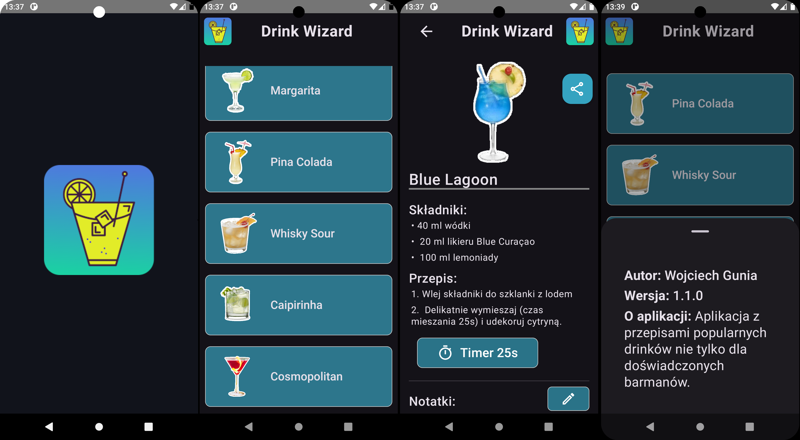
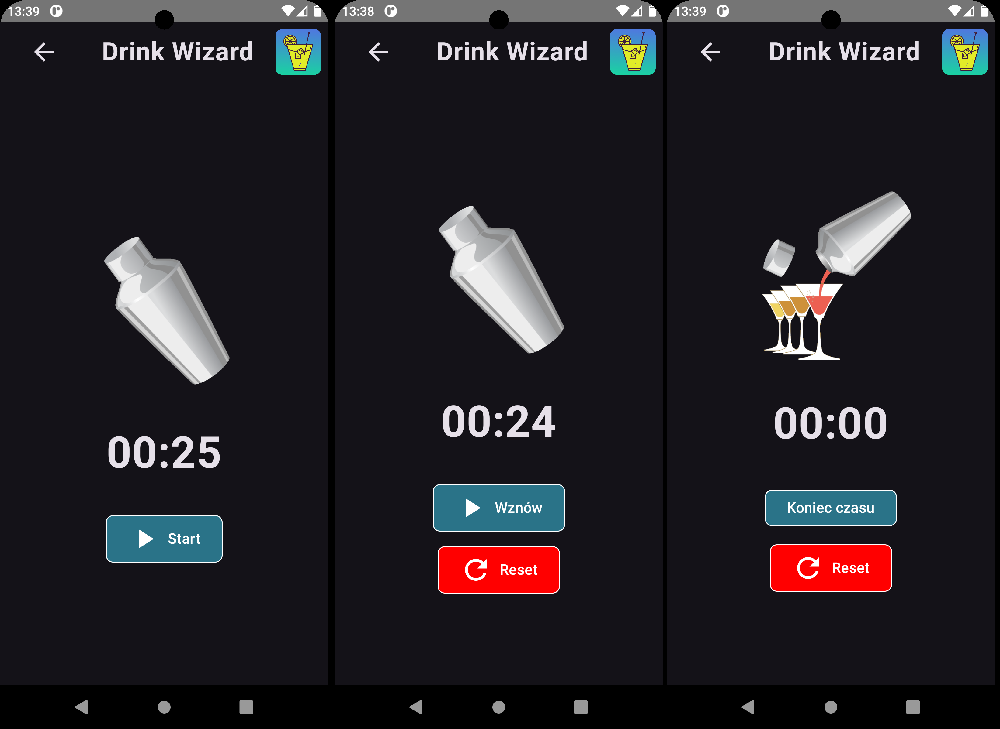
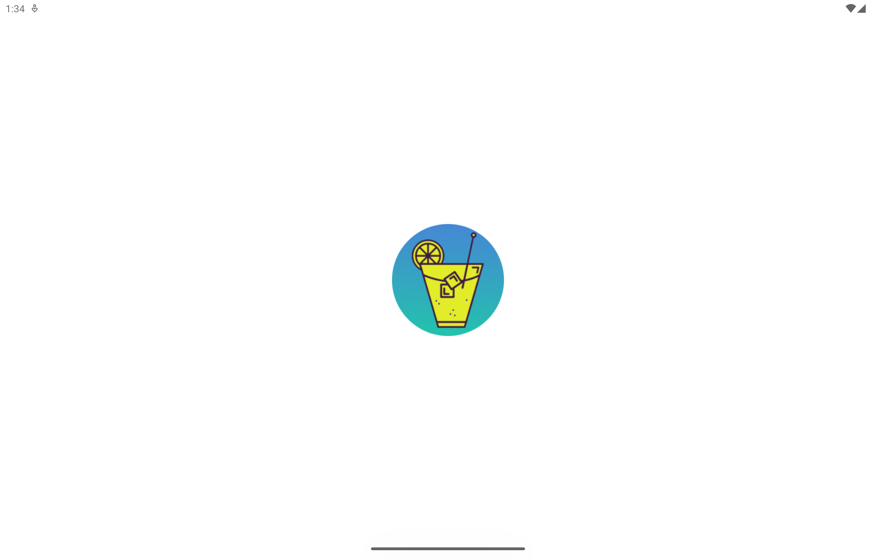
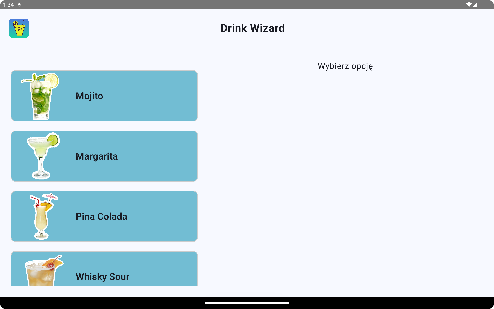
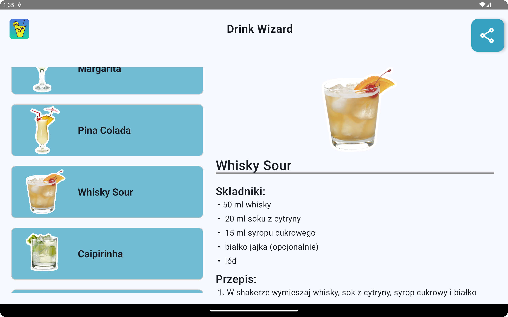
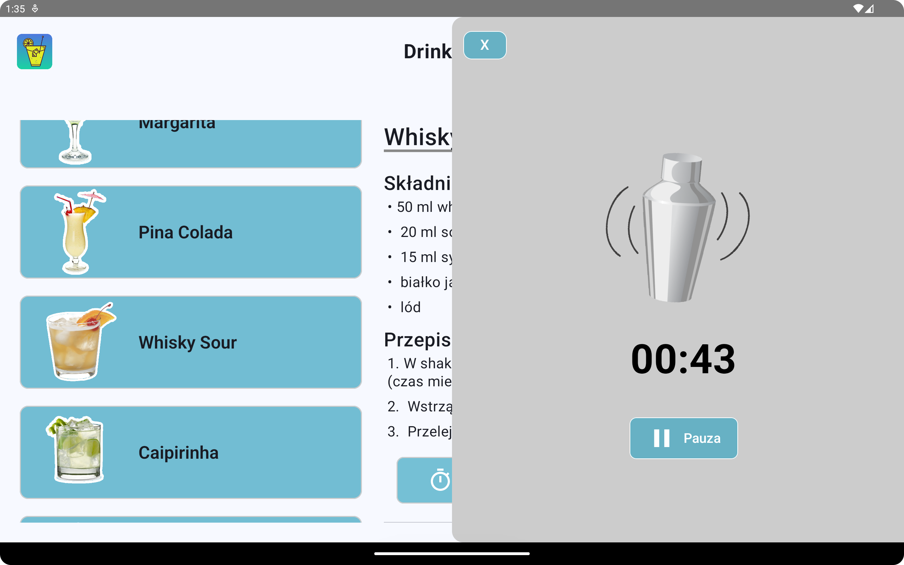

###

###

<h1 align="left">Projekt: Drink Wizard</h1>

###

Uczelnia: Politechnika Poznańska Przedmiot: Aplikacje mobilne Autor: Wojciech Gunia

###

<h2 align="left">Zakres projektu:</h2>

###

📱 Drink Wizard to mobilna aplikacja stworzona z wykorzystaniem Android Studio, języka Kotlin oraz bibliotek Room i Jetpack Compose. Jej celem jest ułatwienie użytkownikom przygotowywania popularnych koktajli poprzez dostarczenie intuicyjnego i estetycznego interfejsu użytkownika oraz szeregu przydatnych funkcjonalności.

W aplikacji zaimplementowano m.in.:

<ul align="left">
  <li>Splash Screen</li>
  <li>Listę drinków</li>
  <li>Szczegóły wybranego drinka</li>
  <li>Timer odliczający czas shakowania drinka</li>
  <li>Wsparcie trybu jasnego i ciemnego</li>
  <li>Responsywny design dla różnych urządzeń</li>
</ul>

🗃↔🖼 Projekt oparty jest na architekturze MVVM, która umożliwia przejrzyste rozdzielenie logiki aplikacji. Model zarządza lokalną bazą danych za pomocą biblioteki Room (SQLite), a komponent ViewModel odpowiada za synchronizację danych z interfejsem graficznym i utrzymanie stanu aplikacji.

  📱🖥Jetpack Compose zapewnia dynamiczne i elastyczne prezentowanie treści, dostosowane do orientacji ekranu (pionowej i poziomej) oraz różnych rozdzielczości – zarówno na smartfonach, jak i tabletach. Wsparcie dla motywów kolorystycznych pozwala na komfortowe korzystanie z aplikacji w różnych warunkach oświetleniowych.

###

<h2 align="left">Technologie:</h2>

###

  
  
  
  
  

###

<h2 align="left">Screenshots:</h2>

<h3 align="left">Mobile phones:</h3>

  
Splash screen | Lista drinków | Szczegóły grinka | O aplikacji 📱

  

  
Timer ⏰

  

<h3 align="left">Tablets:</h3>

  
Splash screen 🔁

  

  
Lista drinków 🍹

  
  
  

